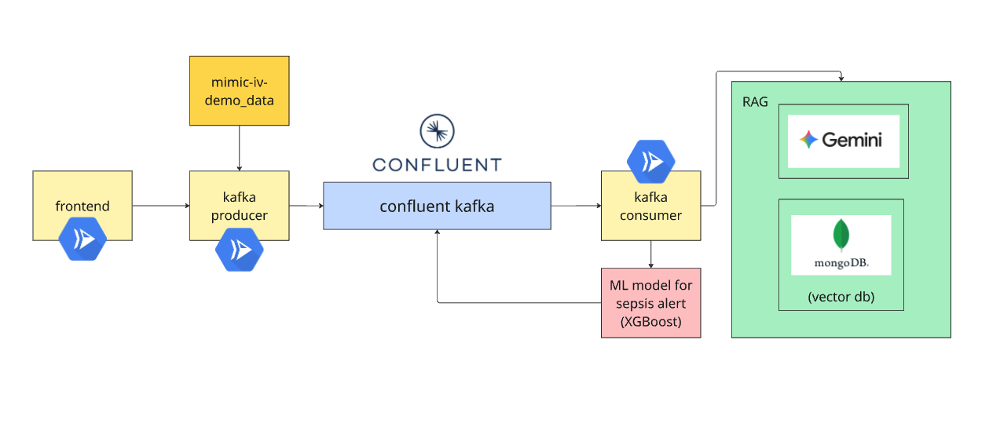

# Aorta: Real-Time Hospital Admission & Sepsis Monitoring

Aorta is a real-time event streaming platform designed to monitor hospital admissions and predict sepsis risks using the MIMIC-IV dataset. It leverages Confluent Cloud for data streaming, Google Cloud Platform (GCP) for hosting, and Generative AI (Gemini) for clinical recommendations.

## 🏗 System Architecture

The system consists of five main components:

1.  **Infrastructure (Terraform)**: Automated setup of Confluent Cloud resources (Kafka Cluster, Topics, Flink Compute Pool, Schema Registry).
2.  **Data Producers (Python)**: Time-coordinated streaming of clinical events (Admissions, ICU Stays, Labs, Vitals) to Kafka.
3.  **ML Engine (XGBoost)**: Real-time sepsis prediction model trained on MIMIC-IV data (6-hour prior prediction window).
4.  **RAG System (Gemini + MongoDB)**: Retrieval-Augmented Generation system that provides clinical treatment recommendations based on sepsis alerts and medical guidelines.
5.  **Web Application (FastAPI + React)**: A real-time dashboard visualizing patient flow, alerts, and risk scores using Server-Sent Events (SSE).

### Data Flow



## 🚀 Prerequisites

-   **Python 3.11+**
-   **Node.js 18+**
-   **Terraform**
-   **Confluent Cloud Account**
-   **Google Cloud Platform Account**
-   **MongoDB Atlas Account** (for RAG vector store)
-   **uv** (Python package manager)

## 🛠 Setup & Installation

### 1. Infrastructure Setup (Terraform)
Navigate to the `terraform` directory to provision Confluent Cloud resources.

```bash
cd terraform
cp terraform.tfvars.example terraform.tfvars
# Edit terraform.tfvars with your Confluent Cloud API keys and GCP details
terraform init
terraform apply
```
*Outputs will provide Kafka configuration needed for the application.*

### 2. Application Setup

Install Python dependencies using `uv`:

```bash
uv sync
source .venv/bin/activate
```

#### Kafka Configuration
Generate the Kafka configuration file from Terraform outputs:

```bash
mkdir Aorta/_data
cd terraform
terraform output -json kafka_config > ../_data/kafka_config.json
cd ..
```

#### Data & RAG Configuration
1.  **Download Database**: Ensure `mimic_demo.db` is placed in the `Aorta/_data/` directory.
download from physionet

2.  **RAG Setup**: Create `Aorta/_data/rag_config.json` using the following template:

```json
{
  "mongodb_connection_string": "cluster0.xxxxx.mongodb.net",
  "mongodb_username": "your_mongodb_username",
  "mongodb_password": "your_mongodb_password",
  "mongodb_database": "sepsis_guidelines",
  "mongodb_collection": "guideline_chunks",
  "gemini_api_key": "your_gemini_api_key_here",
  "rag_enabled": true,
  "rag_probability_threshold": 0.5,
  "_comments": {
    "mongodb_connection_string": "MongoDB Atlas cluster URL (without credentials)",
    "mongodb_username": "MongoDB Atlas database user",
    "mongodb_password": "MongoDB Atlas database password",
    "gemini_api_key": "Get from https://aistudio.google.com/app/apikey",
    "rag_probability_threshold": "Minimum sepsis probability to generate recommendations (0.5 = HIGH/CRITICAL only)"
  }
}

```


### 3. ML Model Training 
```bash
# Train on local MIMIC-IV demo data
python -m ml.training.train_local
```
this generate model into models/local

### 4. RAG Knowledge Base Ingestion
To ingest medical PDF guidelines into the vector store:

```bash
python -m rag.ingest_guidelines
```

## 🖥 Usage

### Start the Backend API
The backend serves the API and consumes Kafka messages to push to the frontend.

```bash
# From Aorta/ directory
uvicorn backend.api.main:app --reload --port 8000
```

### Start the Producer Service
The producer service coordinates the simulation clock and streams data.

```bash
# From Aorta/ directory
uvicorn producer_service.main:app --reload --port 9001
```

### Start the Frontend
Navigate to the frontend directory to launch the dashboard.

```bash
cd frontend
npm install
npm run dev
```

Visit `http://localhost:5173` to view the dashboard.

### Run a Simulation
You can start a simulation via the Producer Service API or the Frontend controls:

```bash
curl -X POST http://localhost:9001/start \
  -H "Content-Type: application/json" \
  -d '{
    "subject_ids": [10000032, 10000980], 
    "start_time": "2110-01-01 00:00:00",
    "tick_minutes": 15
  }'
```

## 📂 Project Structure

-   `terraform/`: Infrastructure as Code for Confluent Cloud.
-   `producers/`: Python scripts for streaming MIMIC-IV data.
-   `producer_service/`: API to control the simulation clock and producers.
-   `coordinator/`: Logic for synchronizing multiple data streams.
-   `backend/`: FastAPI application for the web interface (consumer).
-   `frontend/`: React application for visualization.
-   `ml/`: Machine Learning pipeline (Feature Engineering, Training, Inference).
-   `rag/`: Retrieval-Augmented Generation for clinical insights.
-   `_data/`: Local data storage (MIMIC-IV demo database).

## 📄 License
This project is for educational and demonstration purposes. MIMIC-IV data requires a credentialed access agreement.
